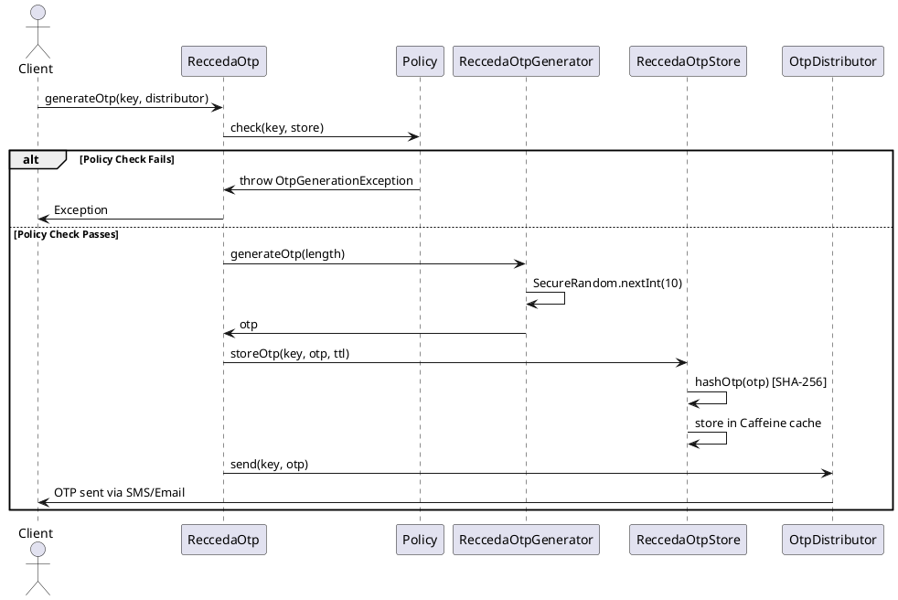
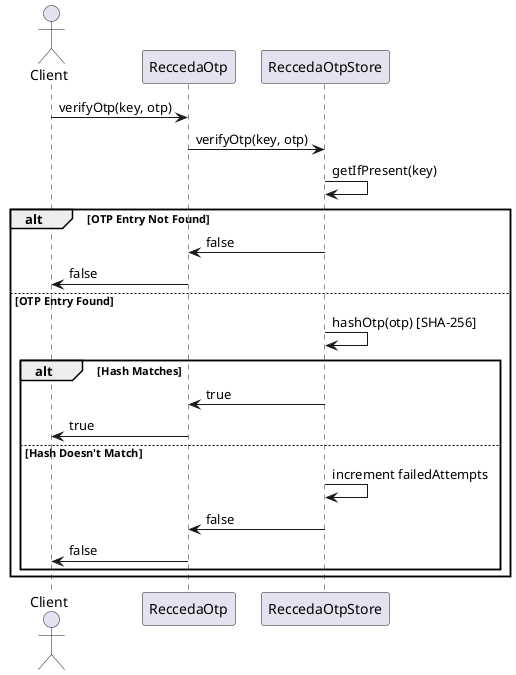
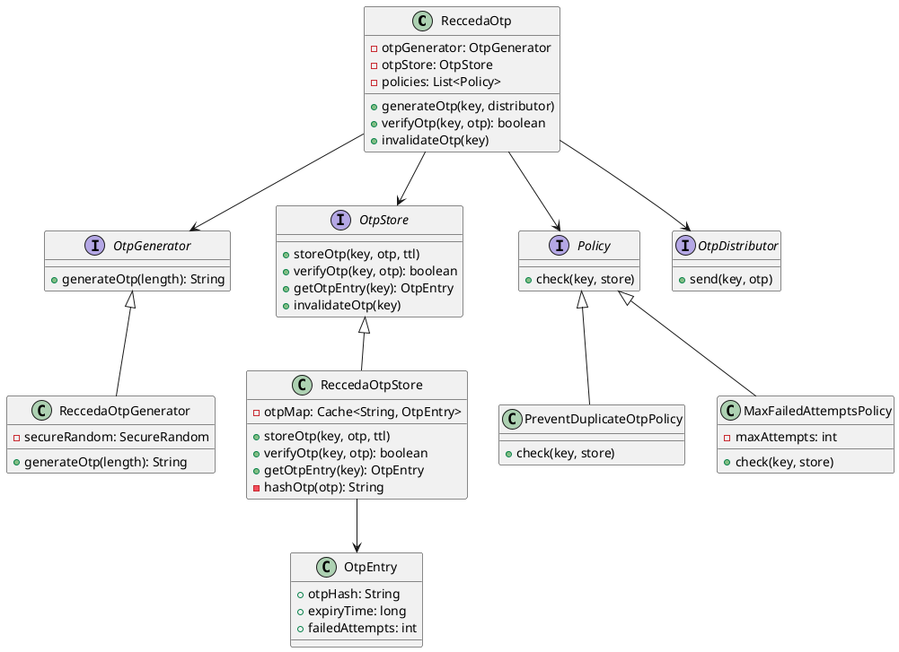
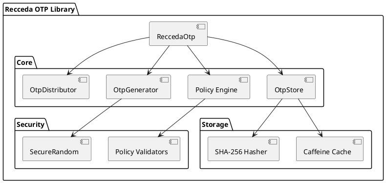

# Recceda OTP Flow Diagram

## OTP Generation Sequence

## OTP Verification Sequence

## Class Diagram

## Component Diagram

## Key Security Features

- **Secure Generation**: `SecureRandom` for cryptographically strong OTPs
- **Secure Storage**: SHA-256 hashed OTPs, never plain text
- **Time-Based Expiration**: Automatic cleanup via Caffeine cache
- **Policy Enforcement**: Configurable generation rules
- **Thread-Safe**: Concurrent access support
- **Failed Attempt Tracking**: Monitors verification attempts